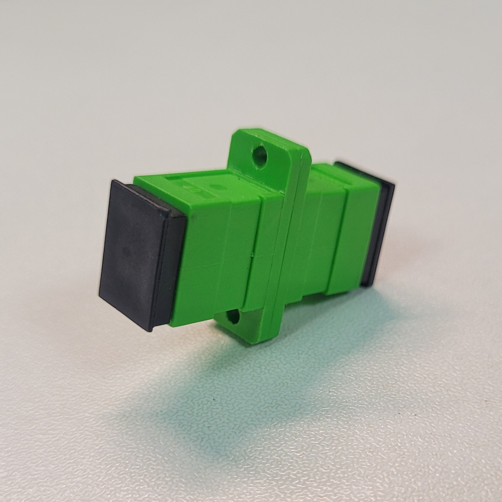
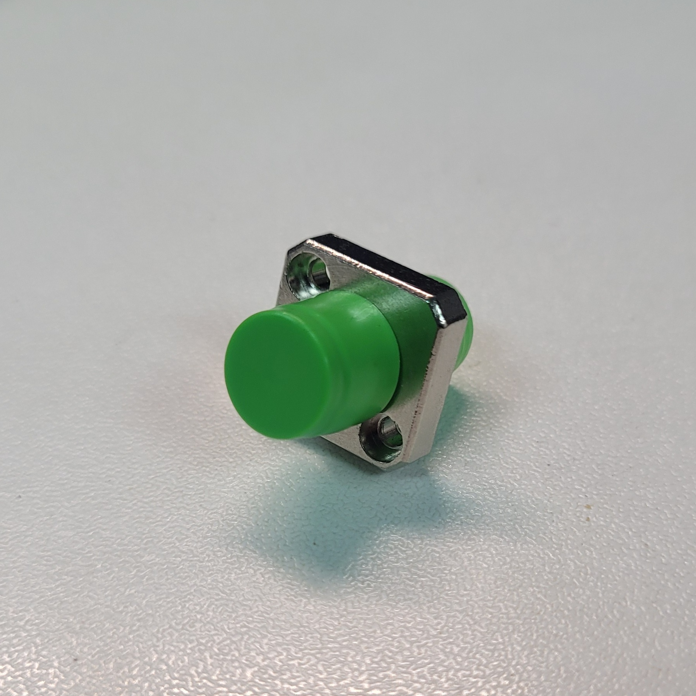

# Kirdy Front Panel 

## Front Panel Text Markings
- Font: PrisonGothicPro-Medium.otf
- Drawn in KiCAD 7

## Front Panel Mechanical Design and Drawings
- Drawn in FreeCAD 0.21.2 with a2plus and Exploded Assembly Workbench installed
- Reference Assembly Kit: nVent SCHROFF 20848-668
- Reference drawings: https://git.m-labs.hk/sinara-hw/front-panels/src/branch/master/Kasli_SOC-vNone

## Front Panel Fiber Optic Adapter Mounting Plates
- Drawn in KiCAD 7
- Mounting Plate can be manufactured as 1.5 mm Aluminum Plate or 1.6 mm Single Layer Aluminum PCB
- Possible Fiber Optic Adapter Compatible for Each Type of Mounting Plate
    - Type 1: SC to SC Fibre Optic Adapter
    
    - Type 2: FC to FC Fiber Optic Adapter
    
